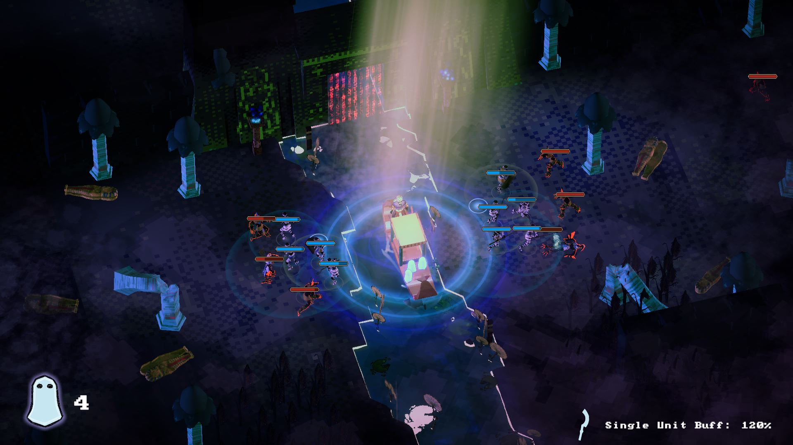
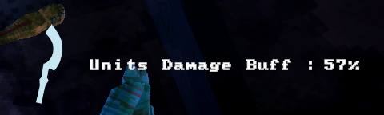
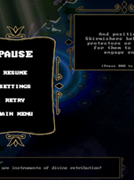
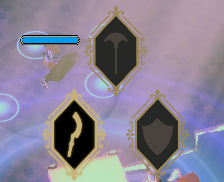

# Barque of Ra

My second semester project at S4G Berlin; my first Unity project at this scope.   
In 10 weeks our team of 12 built a minimalistic real-time tactics game set in the underworld of ancient Egypt,   
where souls serve both as health points and resource for summoning defenders.

As sun god Ra, players aim to ferry these souls down the river Nile into the afterlife.   
If at least 1 soul survives, the game is won.   
Along the way they will pass numerous gates where their boat is stopped and their skills tested.   
Tower defense-style waves of attackers must be fended off by converting souls into different types of battle units.   
Any monster that makes it past the guards will trade itself for a soul on the boat.   
Cleverly choosing and relocating these units on predefined slots is how players protect the Barque of Ra.   

## Recap
| | | | | |
| :----: | :----: | :----: | :----: | :----: | 
| **Programming Main Tasks** | Menus | Controls | HUD | Scene Transitions | 
| **Programming Support** | Combat | Units | Tutorial | Music System |
| **Production** | Coordination | Adaptation | Structure | Listening |

A fairly large and disparate team for the time, I learned many humbling leadership and teamwork lessons here.
It took as a long time to land on a clear game concept and find a way of working together effectively.

As programmer, I was involved in most systems, except for those related to animation and VFX.
Many of the features in the game were a collaborative effort.
My main area of concern was UI programming. 

I decided it was best to let designers Robert and Shady, who were much more experienced with Unity, take the lead in prototyping, as they could punch out new features really fast.
I saw it as my role to then review and refactor these systems, enhancing maintainability und robustness.

### Unit Buff System
   
To enhance the meaningfulness of gameplay decisions, lead designer Teimu requested units' attack power to scale depending on the amount of souls and units on the field.

This feature touched 
- the units & combat system, which Christian spearheaded,
- the barque, soul and slot systems, which Robert had birthed,
- my HUD system, to display the information

### Menu + Pause System

After planning together, Robert prototyped the system for tutorial and lore popups.
We had different kinds of menus that could appear in different orders:
unit select, tutorial popups, lore popups, pause menu, settings menu.
Tutorial popups and pause menu were interesting, in that could both pause/unpause the game when opened/closed.
To get the right behaviour, I implemented a modal menu stack which would also track the "first pauser".

A good challenge to learn adapting to different coding styles and devising ways to integrate them into a unified, modular whole.

 

## Player Controller + State Pattern

<!--[Summon Dialog](image/barque_of_ra-summon_dialog.png)-->

On two occasions I dove deep into the minutiae of state patterns.   

- When my co-engineer Christian fell ill, I continued his work on the state machine for combat units.
- Secondly, the player's ui controls (summoning and dragging units) behave differently based on input and in-game situation.

I learned about numerous considerations and approaches of how state pattern can be implemented.
And I learned again, how valuable a flexible and gracious attitude can be when working together on a shared code base - on top of clear communication and effective documentation.

## Team

6 Artists, 3 Designers, 2 Coders, 1 Composer.
